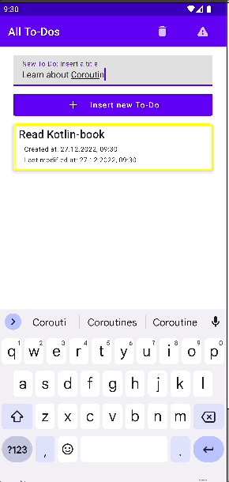
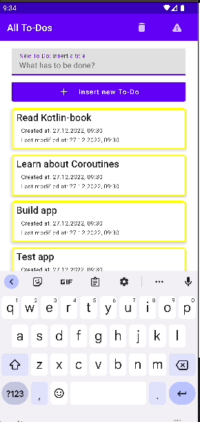
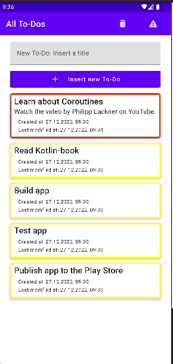
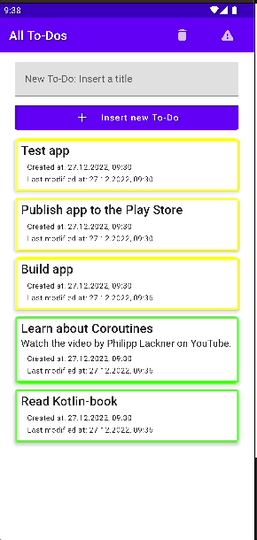

# Task List

Simple Android task list-app, done with Jetpack Compose and Room persistence library.

  &nbsp;&nbsp;&nbsp;&nbsp; 
  &nbsp;&nbsp;&nbsp;&nbsp;  
  &nbsp;&nbsp;
  &nbsp;&nbsp;

  
  &nbsp;&nbsp;
  &nbsp;&nbsp;

